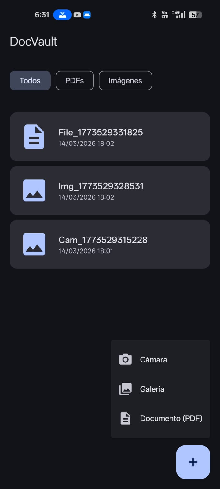

<div align="center">

# DocVault

### Almacenamiento seguro de documentos personales para Android

[](https://developer.android.com)
[](https://kotlinlang.org)
[](https://developer.android.com)
[](documentation/architecture.md)
[](LICENSE)

</div>

---

## 📋 Tabla de Contenidos

- [Descripción](#-descripción)
- [Screenshots](#-screenshots)
- [Características](#-características)
- [Tecnologías y Librerías](#-tecnologías-y-librerías)
- [Arquitectura](#-arquitectura)
- [Estructura del Proyecto](#-estructura-del-proyecto)
- [Requisitos Previos](#-requisitos-previos)
- [Instalación y Configuración](#-instalación-y-configuración)
- [Uso](#-uso)
- [Seguridad](#-seguridad)
- [Calidad y Testing](#-calidad-y-testing)
- [Novedades y Decisiones técnicas destacadas](#-novedades)
- [Contribución](#-contribución)

---

## 📖 Descripción

DocVault es una aplicación Android diseñada para almacenar documentos personales de forma segura en el dispositivo. Permite capturar o importar archivos, almacenarlos localmente con **cifrado AES-256** y acceder a ellos exclusivamente mediante **autenticación biométrica**.

El objetivo principal es demostrar buenas prácticas de desarrollo Android moderno, priorizando:

- **Seguridad** de la información del usuario
- **Arquitectura limpia** y modular
- **Experiencia de usuario** fluida con Jetpack Compose
- **Calidad de código** mediante pruebas unitarias, de instrumentación y análisis estático.

---

## 📸 Screenshots

|                Pantalla de Inicio                |       Detalle del Documento       |
|:------------------------------------------------:|:---------------------------------:|
|  |           🔗 [Ver diseños completos y capturas en Google Drive](https://drive.google.com/drive/folders/1qSoMaPFMZ5_jXNeULb0AkK19lM8CWvOa)            |

> **⚠️ Nota de seguridad:** Por políticas de seguridad, el sistema bloquea las capturas de pantalla en la vista de detalle del documento.

---

## 👆 Características

### Funcionalidades Principales

- **Importación de documentos**: Captura con cámara o selección desde el almacenamiento del dispositivo.
- **Almacenamiento cifrado**: Todos los archivos son cifrados con AES-256 antes de ser guardados.
- **Acceso biométrico**: Autenticación mediante huella dactilar o reconocimiento facial.
- **Gestión de documentos**: Visualización, organización y eliminación de documentos almacenados.
- **Historial de acceso**: Registro automático de cada consulta a un documento para fines de auditoría.

### Características Técnicas

- **UI declarativa** con Jetpack Compose y optimizaciones de estabilidad de recomposición.
- **Gestión de estados** reactiva mediante `StateFlow` y el patrón Unidirectional Data Flow (UDF).
- **Inyección de dependencias** centralizada con Hilt.
- **Cobertura de pruebas** medida con JaCoCo e integrada con SonarQube.

---

## 🛠️ Tecnologías y Librerías

| Categoría              | Tecnología                                    |
|------------------------|-----------------------------------------------|
| **Lenguaje**           | Kotlin                                        |
| **Concurrencia**       | Coroutines + Flow                             |
| **UI**                 | Jetpack Compose                               |
| **Inyección de Deps.** | Hilt                                          |
| **Persistencia**       | Room + KSP                                    |
| **Seguridad**          | Biometric API, Jetpack Security (EncryptedSharedPreferences / Crypto) |
| **Componentes**        | ViewModel, Lifecycle (Architecture Components) |
| **Procesamiento**      | KSP (Kotlin Symbol Processing)                |
| **Calidad**            | SonarQube, JaCoCo, JUnit 4, Espresso, Compose Test |

---

## 🏗️ Arquitectura

El proyecto sigue los principios de **Clean Architecture** combinados con el patrón **MVVM** en la capa de presentación.

```
┌─────────────────────────────────────────┐
│           Capa de Presentación          │
│     (Jetpack Compose + ViewModel)       │
├─────────────────────────────────────────┤
│           Capa de Dominio               │
│    (Use Cases, Models, Repositories)    │
├─────────────────────────────────────────┤
│           Capa de Datos                 │
│    (Room, File System, Mappers)         │
└─────────────────────────────────────────┘
```

Para una descripción completa de la arquitectura, capas, flujo de datos y decisiones de diseño:

👉 [Ver documentación completa de Arquitectura](documentation/architecture.md)

---

## 📁 Estructura del Proyecto

El proyecto está organizado en módulos Gradle, siguiendo el principio de **separación de responsabilidades**:

```
DocVault/
├── app/          # Punto de entrada y UI principal (Screens, Navigation)
├── domain/       # Lógica de negocio pura (Use Cases, Models, Repository Interfaces)
├── data/         # Fuentes de datos (Room DB, File System, Repository Implementations)
├── core/         # Utilidades transversales (Cifrado AES-256, Biometría, Extensiones)
├── design/       # Sistema de diseño (Tema, Colores, Tipografía, Componentes atómicos)
└── di/           # Configuración centralizada de Inyección de Dependencias (Hilt Modules)
```

| Módulo     | Responsabilidad                                              |
|------------|--------------------------------------------------------------|
| `:app`     | Punto de entrada, navegación y pantallas de la UI.           |
| `:domain`  | Lógica de negocio pura, independiente de Android.            |
| `:data`    | Repositorios, Room Entities, DAOs y cifrado de archivos.     |
| `:core`    | Seguridad (AES-256), biometría y utilidades compartidas.     |
| `:design`  | Sistema de diseño y componentes Compose reutilizables.       |
| `:di`      | Módulos Hilt para la configuración de dependencias.          |

---

## ✅ Requisitos Previos

- **Android Studio** Hedgehog (2023.1.1) o superior
- **JDK** 17 o superior
- **Android SDK** con API Level 29 (Android 10.0) como mínimo
- Dispositivo o emulador con soporte para **autenticación biométrica**

---

## 🚀 Instalación y Configuración

1. **Clona el repositorio:**
   ```bash
   git clone https://github.com/johannfjs/docvault-android
   cd docvault-android
   ```

2. **Abre el proyecto** en Android Studio.

3. **Sincroniza las dependencias** de Gradle:
   ```bash
   ./gradlew build
   ```

4. **Ejecuta la aplicación** en un dispositivo o emulador:
   ```bash
   ./gradlew :app:installDebug
   ```

> **Nota:** Para probar la autenticación biométrica, asegúrate de tener configurada al menos una huella dactilar o método biométrico en el dispositivo/emulador.

---

## 📱 Uso

1. **Primer acceso**: Al abrir la app por primera vez, se solicitará configurar la autenticación biométrica.
2. **Agregar documento**: Usa el botón `+` para capturar con la cámara o seleccionar un archivo existente.
3. **Ver documento**: Autentícate con biometría para acceder al contenido del documento.
4. **Historial**: Cada acceso queda registrado automáticamente para auditoría.

---

## 🔐 Seguridad

DocVault implementa múltiples capas de seguridad para proteger la información del usuario:

| Mecanismo                         | Descripción                                                                 |
|-----------------------------------|-----------------------------------------------------------------------------|
| **Cifrado AES-256**               | Todos los archivos son cifrados antes de guardarse en el almacenamiento interno. |
| **Autenticación Biométrica**      | Acceso protegido por huella dactilar o reconocimiento facial (Biometric API). |
| **EncryptedSharedPreferences**    | Las claves y metadatos sensibles se almacenan cifrados con Jetpack Security. |
| **Bloqueo de capturas**           | La vista de detalle bloquea screenshots y grabación de pantalla a nivel de sistema. |
| **Almacenamiento Interno**        | Los archivos cifrados se guardan en el directorio privado de la app, inaccesible sin root. |

---

## 🧪 Calidad y Testing

El proyecto integra **JaCoCo** y **SonarQube** para garantizar la calidad del código y la cobertura de pruebas.

### Estrategia de Testing
- **Pruebas Unitarias**: Validación de lógica de negocio, ViewModels y Mappers (JUnit 4 + MockK + Kluent).
- **Pruebas de Instrumentación**: Pruebas de integración y UI en dispositivos reales o emuladores (Espresso + Compose Test).

### Análisis de Calidad y Cobertura
Para generar el reporte de cobertura y realizar el análisis estático:

```bash
# Ejecutar tests y generar reporte Jacoco
./gradlew jacocoTestReport

# Enviar análisis a SonarQube
./gradlew sonar -Dsonar.token=TU_TOKEN
```

El reporte de Jacoco se genera en:
```
app/build/reports/jacoco/jacocoTestReport/html/index.html
```

> Se configuraron exclusiones para clases generadas por Hilt, Room, componentes de diseño y UI que no requieren pruebas unitarias directas, permitiendo que SonarQube se centre en la lógica crítica.

---

## 🆕 Novedades y Decisiones Técnicas Destacadas

### 1. Seguridad (AES-256 + Biometric API)

A diferencia de aplicaciones que solo guardan archivos, DocVault implementa una cadena de confianza técnica de extremo a extremo:

- **Cifrado en Reposo**: Los documentos se cifran con AES-256 antes de tocarse el almacenamiento, haciéndolos ilegibles sin la clave correcta.
- **Puente Biométrico**: `BiometricAuthenticator` vincula el acceso directamente al hardware del dispositivo (`BIOMETRIC_STRONG` + `DEVICE_CREDENTIAL`), garantizando que solo el dueño físico pueda descifrar los datos.
- **Bloqueo de Capturas** (`FLAG_SECURE`): Protección activa a nivel de ventana del sistema que impide capturas de pantalla y grabación mientras se visualiza un documento sensible — estándar en aplicaciones bancarias.

---

### 2. Arquitectura de Puertos y Adaptadores (Clean Architecture)

El proyecto está desacoplado de una manera profesional y deliberada:

- **Inversión de Dependencias**: La interfaz `BiometricAuthenticator` en el módulo `:core` permite que el resto de la app no dependa de la implementación concreta de Android. Cambiar de librería biométrica en el futuro no requiere tocar la lógica de negocio.
- **Modularización por Responsabilidad**: La separación en `:app`, `:domain`, `:data`, `:core`, `:design` y `:di` es una práctica avanzada que reduce tiempos de compilación incremental y facilita la escalabilidad del proyecto a largo plazo.

---

### 3. Optimizaciones de Rendimiento en UI (Estabilidad de Compose)

Se atacó uno de los problemas más sutiles de Jetpack Compose — el control fino de recomposiciones:

- **Colecciones Inmutables**: Uso de `ImmutableList<T>` para forzar al compilador de Compose a tratar las listas como estables, evitando recomposiciones innecesarias al actualizar un ítem de la lista.
- **Tipos Primitivos Estables**: Implementación de `ImmutableByteArray` con overrides de `equals`/`hashCode` para tipos mutables como `ByteArray`, que de otro modo romperían la estabilidad del árbol de composición.
- **Impacto real**: Mayor fluidez al hacer scroll, menor consumo de batería y CPU en dispositivos de gama media-baja.

---

### 4. Inyección de Dependencias Robusta con Hilt

- **Scoped Injections**: Uso de `@ApplicationContext` e `@Inject` para gestionar el ciclo de vida de componentes críticos como el autenticador biométrico, previniendo *memory leaks* al evitar retener `Activity Context` de forma indebida.
- **Módulo centralizado** (`:di`): Toda la configuración de dependencias vive en un único módulo, simplificando el mantenimiento y las pruebas.

---

### 5. Auditoría Interna con Mappers de Dominio

- **Historial de Acceso**: Cada consulta a un documento queda registrada automáticamente. Técnicamente, se implementaron `Mappers` que transforman timestamps crudos de la base de datos en objetos de dominio formateados según el `Locale` del dispositivo, manteniendo la lógica de presentación completamente fuera de la capa de datos.

---

### 6. Calidad de Software con SonarQube & JaCoCo

- **Análisis de Cobertura**: La integración de JaCoCo mide el porcentaje del código cubierto por pruebas unitarias e instrumentales.
- **Análisis Estático**: SonarQube se utiliza para detectar smells, vulnerabilidades y mantener la deuda técnica bajo control, integrando los reportes de cobertura multi-módulo.

---

## 🤝 Contribución
Las contribuciones son bienvenidas. Por favor, sigue estos pasos:
1. Haz un **fork** del repositorio.
2. Crea una rama para tu feature: 'git checkout -b feature/nueva-funcionalidad'
3. Realiza tus cambios y escribe pruebas unitarias.
4. Verifica que la cobertura no disminuye: './gradlew jacocoTestReport'
5. Crea un **Pull Request** describiendo tus cambios.