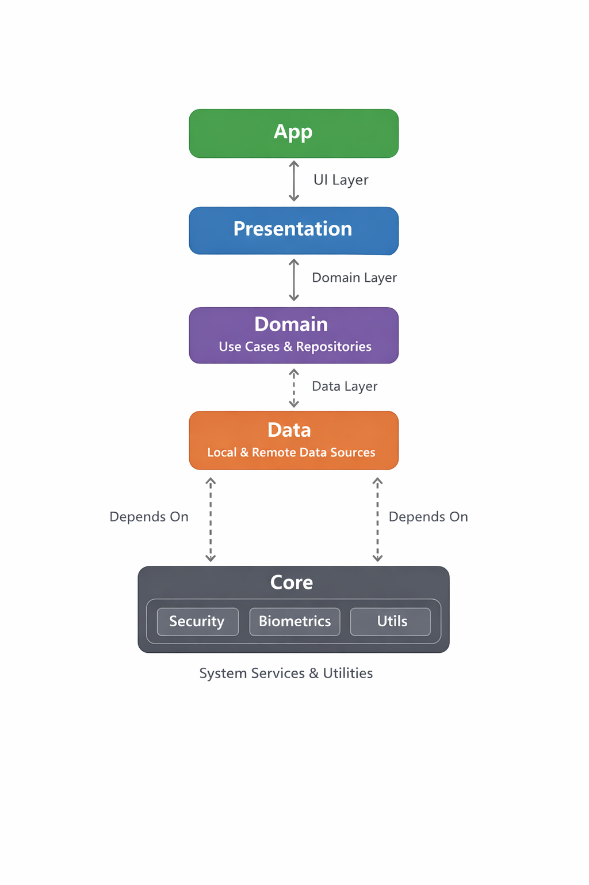

# Arquitectura de DocVault

DocVault se basa en los principios de **Clean Architecture** para garantizar que el código sea testeable, mantenible y escalable.

## Principios de Diseño
- **Separación de Responsabilidades**: Cada módulo tiene una responsabilidad única y bien definida.
- **Independencia de Frameworks**: El núcleo de la lógica de negocio (dominio) no depende de librerías externas o detalles de implementación de Android.
- **Inyección de Dependencias**: Utilizamos **Hilt** para desacoplar componentes y facilitar las pruebas unitarias.

## Diagrama de Módulos
A continuación se muestra el flujo y las dependencias entre los diferentes módulos del proyecto:



## Capas de la Arquitectura

### 1. Capa de Dominio (`:domain`)
Contiene la lógica de negocio pura.
- **Modelos**: Entidades de datos que representan el negocio.
- **Use Cases**: Definen las acciones que el usuario puede realizar.
- **Interfaces de Repositorio**: Contratos que la capa de datos debe implementar.

### 2. Capa de Datos (`:data`)
Responsable de gestionar el origen de la información.
- **Implementaciones de Repositorio**: Orquestan el flujo de datos entre las fuentes.
- **Mappers**: Transforman modelos de datos (ej: Room Entities) a modelos de dominio.
- **Local Data Sources**: Room Database para metadatos y File System para documentos cifrados.

### 3. Capa de Presentación (`:app`)
Implementa el patrón **MVVM** con **Jetpack Compose**.
- **ViewModels**: Mantienen el estado de la UI y se comunican con los casos de uso.
- **UI (Screens/Components)**: Interfaces declarativas con Compose.

### 4. Módulos de Apoyo
- **`:core`**: Funcionalidades compartidas como seguridad (cifrado AES), utilidades de biometricos y extensiones.
- **`:design`**: Sistema de diseño (temas, colores, tipografía) y componentes de UI atómicos.

## Flujo de Datos
1. La **UI** captura un evento del usuario.
2. El **ViewModel** llama a un **UseCase**.
3. El **UseCase** solicita datos al **Repository**.
4. El **Repository** decide si los datos vienen de la DB local o del almacenamiento.
5. El flujo de datos (via **Flow**) regresa al ViewModel, que actualiza el estado de la UI.

## Calidad de Código y Coverage
Para asegurar la calidad del código, el proyecto integra **Jacoco** para la medición de cobertura de pruebas unitarias.

### Generar Reporte de Cobertura
Para generar el reporte de Jacoco, ejecuta el siguiente comando en la terminal:

```bash
./gradlew jacocoTestReport
```

Los reportes se generarán en formato HTML y XML en la siguiente ruta:
`app/build/reports/jacoco/jacocoTestReport/html/index.html`

El reporte incluye:
- Porcentaje de líneas de código cubiertas.
- Cobertura de ramas.
- Complejidad ciclomática.

Se han configurado exclusiones para clases generadas por Hilt, Room y componentes de Android que no requieren pruebas unitarias directas.
