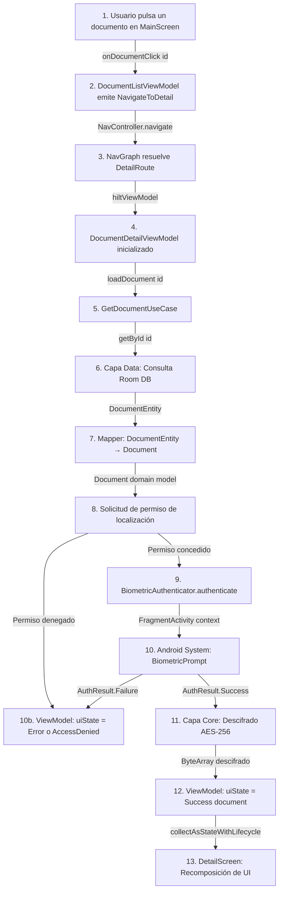

# Arquitectura de DocVault

DocVault implementa **Clean Architecture** combinada con el patrón **MVVM** en la capa de presentación, garantizando un código testeable, mantenible y escalable. La arquitectura está inspirada en el modelo de **Puertos y Adaptadores**: el núcleo del sistema no conoce los detalles de Android, y cada capa se comunica únicamente a través de contratos (interfaces).

---

## Principios de Diseño

| Principio | Aplicación en DocVault |
|---|---|
| **Separación de Responsabilidades** | Cada módulo Gradle tiene una responsabilidad única y bien definida. |
| **Independencia de Frameworks** | El módulo `:domain` es Kotlin puro — sin dependencias de Android ni librerías externas. |
| **Inversión de Dependencias** | Las capas externas dependen de abstracciones (interfaces), no de implementaciones concretas. |
| **Inyección de Dependencias** | **Hilt** gestiona el ciclo de vida de los componentes y desacopla la construcción del grafo de objetos. |

---

## Diagrama de Módulos

A continuación se muestra el flujo de dependencias entre los módulos del proyecto. Las flechas indican la dirección de la dependencia — **siempre hacia adentro**, nunca hacia afuera.

```
        ┌──────────┐     ┌────-──────┐
        │  :design │     │    :di    │
        └────┬─────┘     └────-┬─────┘
             │                 │
        ┌────▼─────────────────▼─────┐
        │           :app             │
        │   (Compose UI + ViewModel) │
        └────────────┬───────────────┘
                     │
        ┌────────────▼───────────────┐
        │          :domain           │
        │  (Use Cases + Interfaces)  │
        └────────────┬───────────────┘
                     │
        ┌────────────▼───────────────┐
        │           :data            │
        │  (Room + File System)      │
        └────────────┬───────────────┘
                     │
        ┌────────────▼───────────────┐
        │           :core            │
        │  (Cifrado + Biometría)     │
        └────────────────────────────┘
```

---

## Capas de la Arquitectura

### 1. Capa de Dominio (`:domain`)

El corazón del sistema. Es **Kotlin puro**, sin ninguna dependencia de Android ni de librerías externas.

- **Modelos de Dominio**: Entidades que representan los conceptos del negocio (ej: `Document`).
- **Use Cases**: Encapsulan una acción atómica del sistema (ej: `SaveDocumentUseCase`, `GetDocumentsUseCase`). Cada use case tiene una única responsabilidad.
- **Interfaces de Repositorio**: Contratos que definen *qué* se puede hacer con los datos, sin especificar *cómo*. La implementación vive en `:data`.

> **¿Por qué importa?** Si mañana se reemplaza Room por SQLDelight, o el sistema de archivos por un backend remoto, el módulo `:domain` no se toca.

---

### 2. Capa de Datos (`:data`)

Responsable de implementar los contratos del dominio y gestionar el origen de la información.

- **Implementaciones de Repositorio**: Orquestan de qué fuente obtener o persistir los datos.
- **Mappers**: Transforman modelos de infraestructura (ej: `DocumentEntity` de Room) en modelos de dominio y viceversa. Mantienen las capas aisladas entre sí.
- **Local Data Sources**:
    - `Room Database` — almacena metadatos de documentos y el historial de accesos.
    - `File System` — persiste los archivos cifrados en el almacenamiento interno privado de la app.

---

### 3. Capa de Presentación (`:app`)

Implementa el patrón **MVVM** con **Jetpack Compose** y el principio de **Unidirectional Data Flow (UDF)**.

- **ViewModels**: Exponen el estado de la UI como `StateFlow<UiState>` y reciben eventos del usuario. Se comunican con los use cases y nunca conocen los detalles de Compose.
- **UI State**: Modelos inmutables que representan el estado completo de cada pantalla. Un único objeto de estado elimina inconsistencias entre vistas.
- **Screens / Components**: Interfaces declarativas con Compose. Solo leen estado y emiten eventos — sin lógica de negocio.
```
Usuario → Evento → ViewModel → UseCase → Repository
                      ↑                        ↓
                  UiState ←←←←←←←←←←←← Flow<Data>
```

---

### 4. Módulos de Apoyo

#### `:core` — Seguridad y Utilidades Transversales

Contiene las funcionalidades compartidas que no pertenecen a ninguna capa específica:

- **`CryptoManager`**: Implementación del cifrado AES-256 para archivos.
- **`BiometricAuthenticator`**: Interfaz + implementación del puente biométrico (`BIOMETRIC_STRONG` + `DEVICE_CREDENTIAL`).
- Extensiones de Kotlin y utilidades comunes.

> La interfaz `BiometricAuthenticator` definida aquí es un ejemplo de **Inversión de Dependencias**: el módulo `:domain` depende de la abstracción, no de la implementación de Android.

#### `:design` — Sistema de Diseño

- Tema de la aplicación (colores, tipografía, formas).
- Componentes Compose atómicos y reutilizables.
- Modelos de UI anotados con `@Immutable` para garantizar la estabilidad en Compose.

#### `:di` — Configuración de Dependencias

- Módulos Hilt centralizados para el binding de interfaces con sus implementaciones.
- Gestión de scopes (`@Singleton`, `@ViewModelScoped`) para evitar memory leaks con contextos de Android.

---

## Estabilidad en Jetpack Compose

Una de las optimizaciones más avanzadas del proyecto es el control explícito de la estabilidad del árbol de composición, evitando recomposiciones innecesarias que degradan el rendimiento.

### El Problema

El compilador de Compose necesita saber si los parámetros de un `@Composable` han cambiado para decidir si redibujarlo. Si un tipo es **inestable** (el compilador no puede garantizar inmutabilidad), Compose asume que siempre cambió y lo redibuja en cada frame — incluso si los datos son idénticos.

### Las Soluciones Implementadas

| Problema | Solución |
|---|---|
| `List<T>` estándar de Kotlin es inestable | Wrapper `ImmutableList<T>` que el compilador trata como estable |
| `ByteArray` es mutable por naturaleza | `ImmutableByteArray` con `equals`/`hashCode` correctamente implementados |
| Modelos de UI con campos complejos | Anotación `@Immutable` en clases de estado de la UI |

### Resultado

Los composables **solo se recompongan cuando los datos realmente cambian**, lo que se traduce en:
- Scroll fluido en listas con muchos documentos.
- Menor consumo de CPU y batería, especialmente en dispositivos de gama media-baja.

---

## Flujo de Datos Completo

El siguiente ejemplo ilustra el flujo para el caso de uso **"Abrir un documento"**:


---

## Estrategia de Testing

El proyecto integra **JaCoCo** para medir la cobertura de pruebas unitarias y garantizar que los cambios futuros no rompan la lógica crítica de cifrado o autenticación.
| Tipo de Test | Herramientas | Objetivo |
|---|---|---|
| **Pruebas Unitarias** | JUnit 4, MockK, Kluent | Validar la lógica de negocio en Use Cases, ViewModels y Mappers de forma aislada. |
| **Pruebas de Instrumentación** | Espresso, Compose Test Library | Validar la integración de componentes y el comportamiento de la UI en dispositivos reales o emuladores. |

### Cobertura con JaCoCo
Se utiliza **JaCoCo** para medir qué tanto código está siendo validado por nuestras pruebas. El reporte consolida la cobertura de los módulos del proyecto, permitiendo identificar zonas críticas sin testear.

**Generar reporte:**
```bash
./gradlew jacocoTestReport
```

El reporte consolidado se genera en:
`[módulo]/build/reports/jacoco/jacocoTestReport/html/index.html`

### Análisis con SonarQube
DocVault integra **SonarQube** para centralizar las métricas de calidad y realizar análisis estático:

- **Bugs y Vulnerabilidades**: Identificación temprana de riesgos de seguridad y errores lógicos.
- **Code Smells**: Seguimiento de deuda técnica y cumplimiento de estándares de codificación.
- **Cobertura Consolidada**: Visualización de la cobertura de JaCoCo en todos los módulos (app, domain, data, core).
  
- **Ejecutar análisis:**
 ```bash
 ./gradlew sonar -Dsonar.token=TU_TOKEN
 ```

> **Nota sobre exclusiones**: Se han configurado reglas específicas en Gradle para ignorar archivos generados (Hilt, Room), el módulo de diseño (`:design`) y código de infraestructura de Android (Screens, NavGraphs), asegurando que las métricas reflejen la calidad de la lógica de negocio
